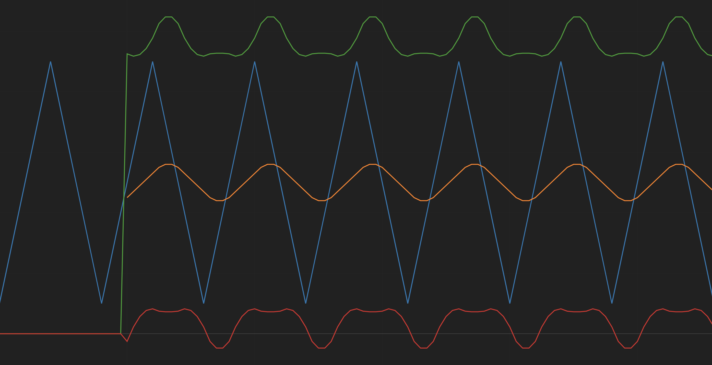
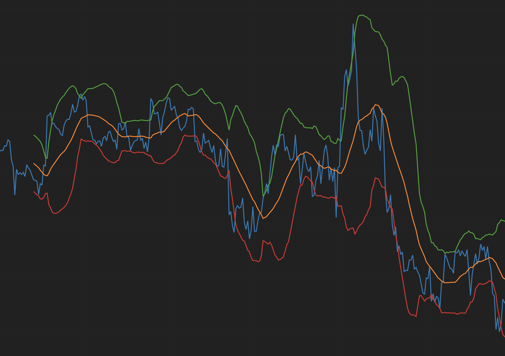

[Bollinger Bands Wiki](https://en.wikipedia.org/wiki/Bollinger_Bands)

### Sample Data
let sample_data = [1,2,3,4,5,6,7,8,9,8,7,6,5,4,3,2,1,2,3,4,5,6,7,8,9,8,7,6,5,4,3,2,1,2,3,4,5,6,7,8,9,8,7,6,5,4,3,2,1,2,3,4,5,6,7,8,9,8,7,6,5,4,3,2,1,2,3,4,5,6,7,8,9,8,7,6,5,4,3,2,1,2,3,4,5,6,7,8,9,8,7,6,5,4,3,2,1,2,3,4,5,6,7,8,9,8,7,6,5,4,3,2,1]

### BTC/USD 1 Hour Granularity

